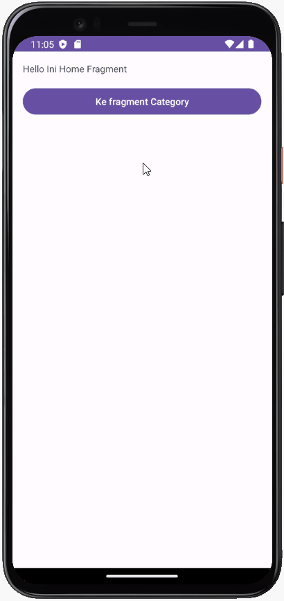

## MyFlexibleFragment

MyFlexibleFragment adalah sebuah aplikasi Android yang dibuat menggunakan bahasa Kotlin untuk mempelajari konsep-konsep berikut:

- Menambahkan Fragment ke dalam Activity.
- Membuat tampilan fleksibel dengan fragment tanpa berpindah Activity.
- Mengirim data antar Fragment.
- Menggunakan DialogFragment untuk membuat Dialog.
- Memanggil Activity dari Fragment.

### Preview

### Cara Menjalankan Aplikasi

1. Pastikan Anda memiliki Android Studio terbaru yang terinstal.
2. Clone repositori ini ke lokal Anda.
3. Buka proyek di Android Studio.
4. Hubungkan perangkat Android Anda ke komputer menggunakan kabel USB, atau gunakan emulator yang telah dikonfigurasi sebelumnya.
5. Jalankan aplikasi dengan menekan tombol "Run" di Android Studio.

### Kontribusi

Jika Anda menemukan bug atau ingin berkontribusi pada proyek ini, silakan buka sebuah _issue_ atau buat _pull request_. Kami sangat terbuka terhadap kontribusi dari komunitas.
